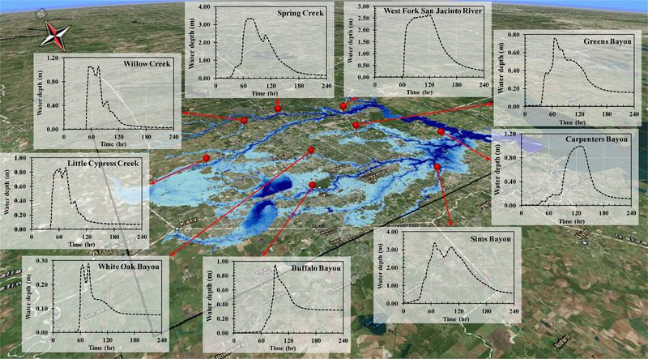

.. _introduction:

Introduction to TRITON
======================

The **Two-dimensional Runoff Inundation Toolkit for Operational Needs (TRITON)** is an open-source,
flood simulation tool designed for modern high-performance computing (HPC). It is a computationally
efficient, physics-based hydraulic model that operates on a structured grid and solves the full
2D shallow-water equations.

Key Features
------------

* **Cross-platform and HPC ready** – Performance-portable via Kokkos.
  Runs on single or multiple CPUs (OpenMP + MPI) and supports GPU acceleration with Kokkos and MPI.
* **Flexible Forcing & Inputs** – Uses topographical data (e.g., DEM, LIDAR) on a uniform Cartesian grid
  and supports streamflow hydrographs, gridded runoff, or both as hydrological forcing.
* **Rich Output Options** – Produces water depth maps, 2D velocity maps, and unit discharge data,
  plus time series outputs at user-defined points and intervals.
* **Linux/Unix Native** – Built for Linux/Unix systems with input/output in ASCII, binary, and GeoTIFF format.
* **SI Units Standard** – Operates using the International System of Units (SI).

Example Output
--------------

What You Need
-------------

To set up and run TRITON, you will need:

* **DEM** – topographic grid of the domain (projected, e.g., UTM).
* **Hydrologic Forcing** – inflow hydrographs, gridded runoff, or both.
* **Manning’s n** – constant roughness or a spatially varying map.
* **Boundary Conditions** – optional, applied at the edges of the domain.
* **Configuration File (.cfg)** – defines paths, timing, and solver parameters.
* **System** – Linux or container environment with CPU or GPU resources.

See :doc:`simulation_setup` for details on supported file types, formats, and directory layout.

Input Overview
--------------

.. image:: _static/input_overview.gif
   :alt: TRITON input overview
   :width: 100%
